# BarteAuctionsApplication
Web application designed to connect users and allow them barter exchange.

## Table of contents
* [General info](#general-info)
* [Screenshots](#screenshots)
* [Technologies](#technologies)
* [Status](#status)

## General info
Application is designated for users who are interested barter exchange. Main goal is connecting people which have unnecessary items and instead of selling them in a traditional way, 
they want to exchange for something more interesting.
Implemented features: 
* add/remove/reissue auction (easy manage own auctions)
* eight different categories
* auction photos max to 5Mb and total images size 50 Mb
* photos stored in DB
* add/remove auction to/from observed
* messaging - send message to auction owner, manage inbox and outbox, quick answer
* search for an auction via title and description
* show all owner auctions. 

## Screenshots
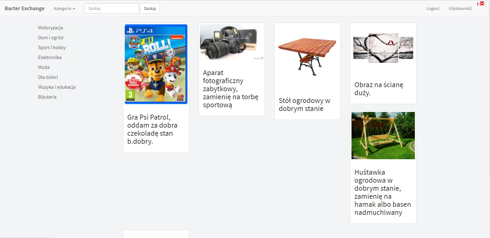
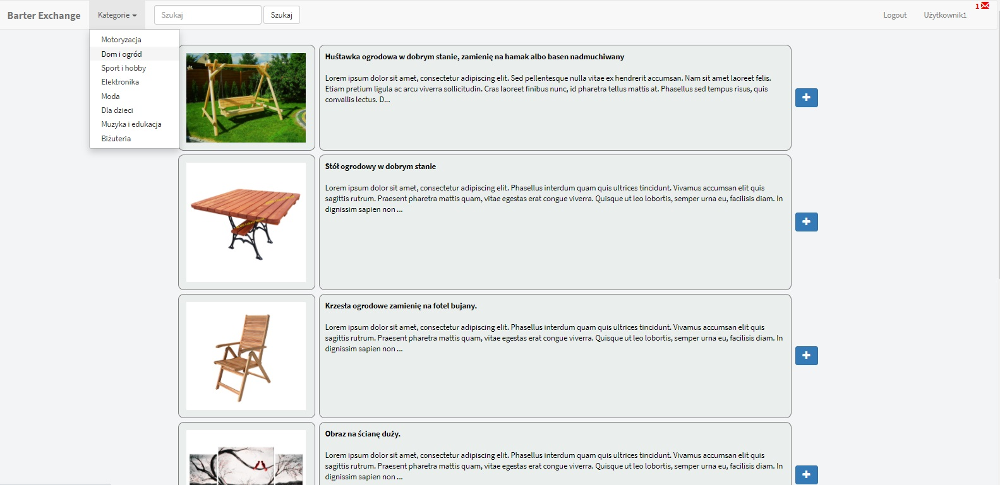
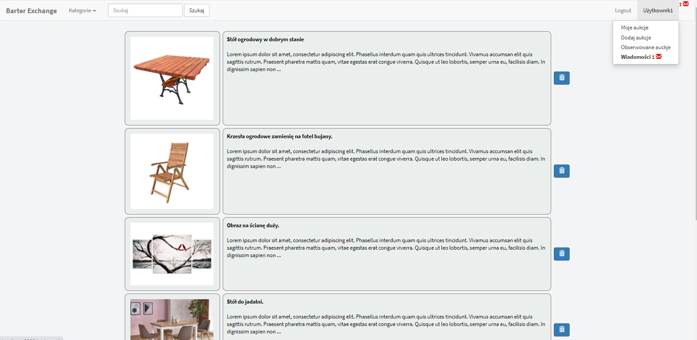
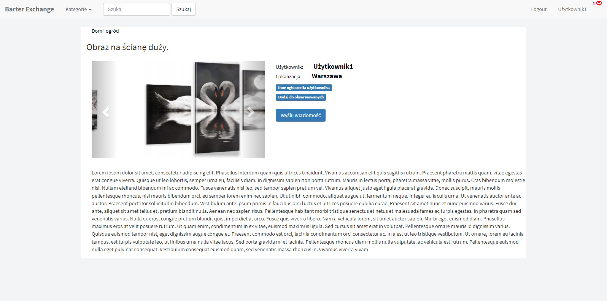
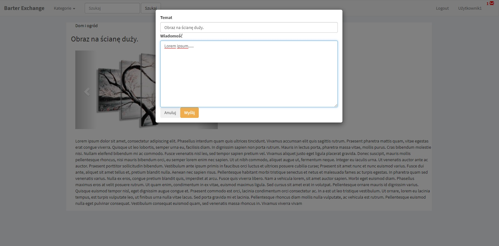
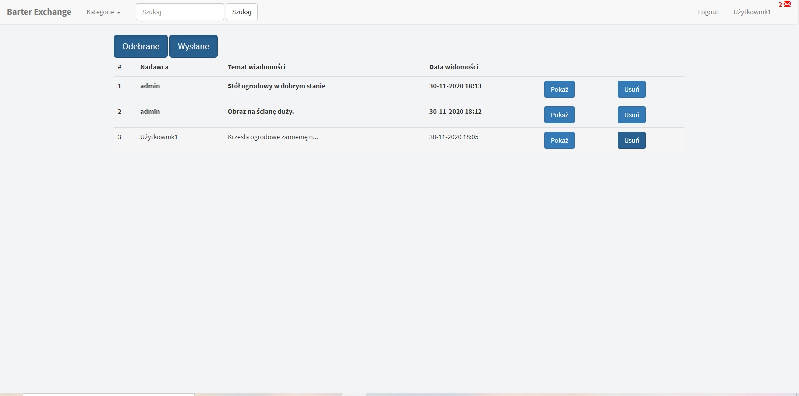
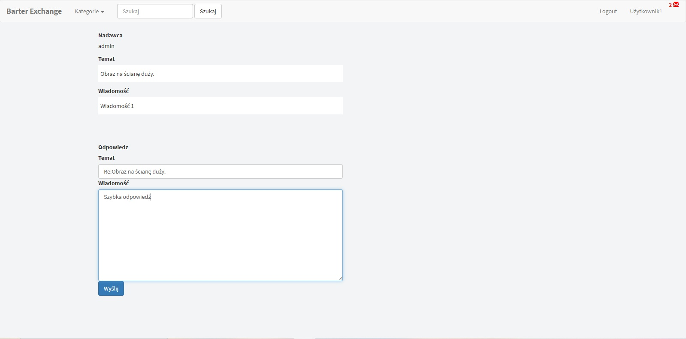
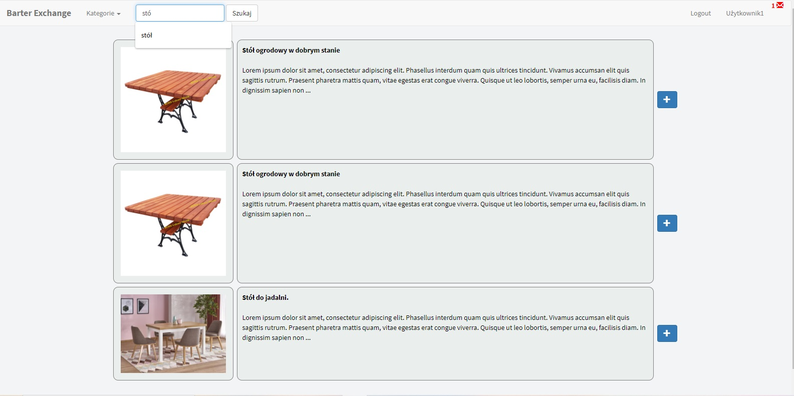
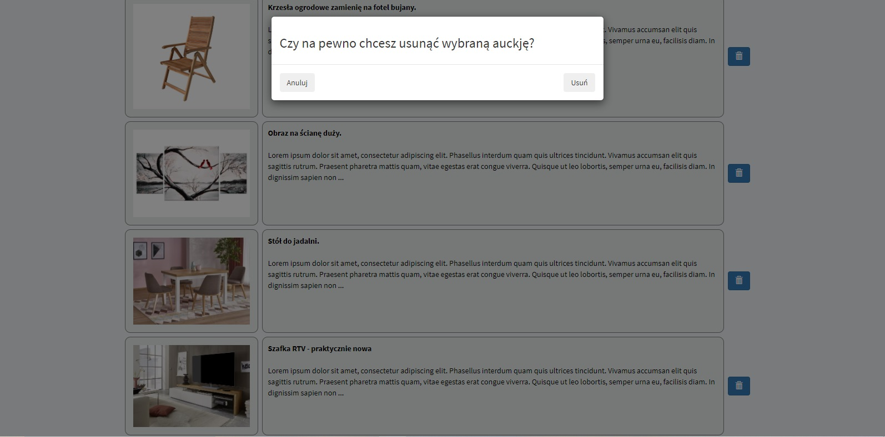
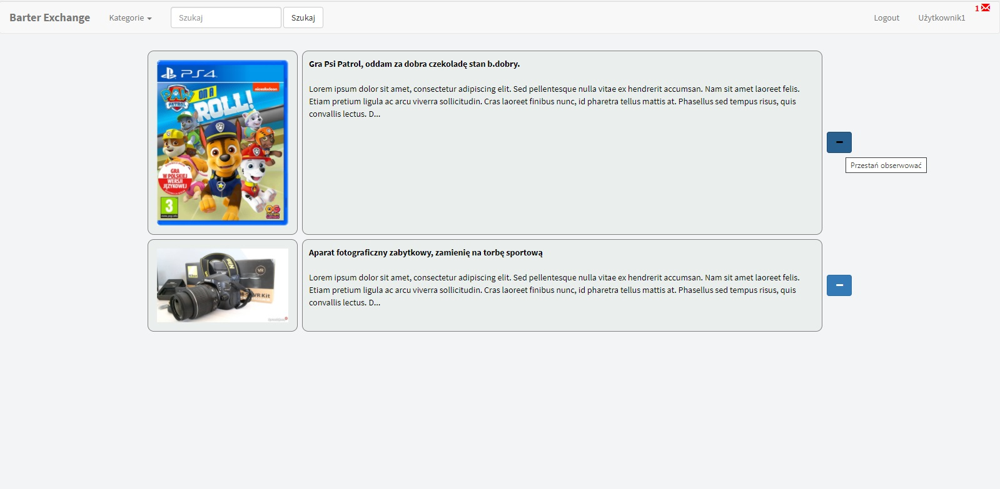
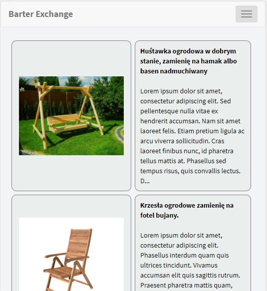

## Technologies
* Spring Boot
* Spring security
* Junit/Mockito
* Maven
* Model mapper
* Hibernate validator
* JpaRepository
* BCrypt
* Thymeleaf
* HTML 5
* CSS

## Status
Project is: _in progress_
